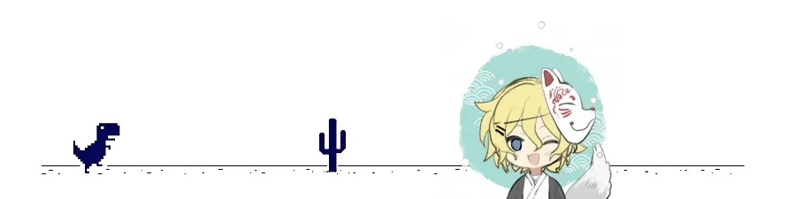

# Who is Thomas Gotwig? 🤠

Hellooo there! 👋 I'm a passioned programmer with background in Bioinformatics from my bachelor study 👨‍🎓 Interested in topics such as Full-Stack-Development, DevOps and Life-Sciences 🧑‍💻

<!--START_SECTION:activity-->
1. ❗️ Closed issue [#102](https://github.com/chmln/sd/issues/102) in [chmln/sd](https://github.com/chmln/sd)
2. 🎉 Merged PR [#8](https://github.com/TGotwig/squat-timer/pull/8) in [TGotwig/squat-timer](https://github.com/TGotwig/squat-timer)
3. 💪 Opened PR [#1](https://github.com/tmforum-apis/TMF639_ResourceInventory/pull/1) in [tmforum-apis/TMF639_ResourceInventory](https://github.com/tmforum-apis/TMF639_ResourceInventory)
4. 🎉 Merged PR [#14](https://github.com/TGotwig/tgotwig/pull/14) in [TGotwig/tgotwig](https://github.com/TGotwig/tgotwig)
5. 🎉 Merged PR [#13](https://github.com/TGotwig/tgotwig/pull/13) in [TGotwig/tgotwig](https://github.com/TGotwig/tgotwig)
<!--END_SECTION:activity-->
