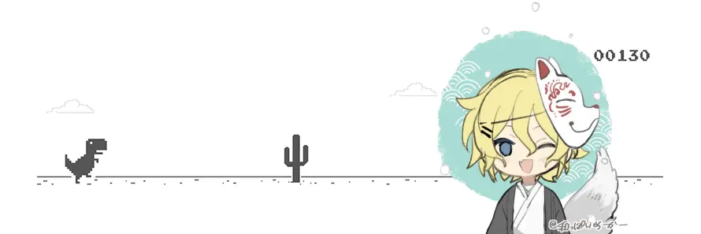

# Who is Thomas Gotwig? 🤠

Hellooo there! 👋 I'm a passioned programmer with background in Bioinformatics from my bachelor study 👨‍🎓 Interested in topics such as Full-Stack-Development, DevOps and Life-Sciences 🧑‍💻

